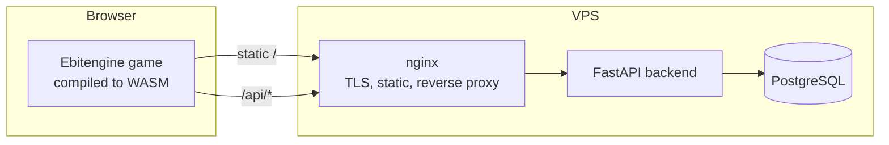

# YurneROGUE

A browser roguelike set in the Dota 2 universe — Go compiled to WebAssembly,
a global leaderboard and a full CI/CD pipeline deploying to a VPS.

**Play in your browser: https://yurnerogue.ru** — desktop and mobile.

[Русская версия](README_RU.md)

| Desktop | Mobile |
|---------|--------|
|  |  |

## About

The Dark Carnival passed through the jungle and did not leave whole: its
creatures stayed and twisted the forest. As Yurnero the Juggernaut you cut
clearings through the thicket and descend twenty-one floors toward the heart of
the Carnival. Every floor is procedurally generated and harder than the last;
every finished run lands on a global leaderboard shared by all players.

This is the third iteration of the project: it began as a terminal roguelike in
Python ([rogue](https://github.com/stariydedd/rogue)), grew a graphical UI and a
DevOps pipeline, and was finally rewritten in Go — see
[Why Go](#why-the-rewrite) below.

## Architecture



The game keeps a layered architecture, with dependencies pointing inwards:

- **`internal/domain/`** — game rules and state: level generation, combat,
  movement, fog of war. No dependency on rendering, input or networking, and
  the only package with tests.
- **`internal/render/`** — Ebitengine drawing: sprites, world map with camera,
  HUD, menus and on-screen touch controls.
- **`internal/game/`** — the state machine tying the two together, plus input.
- **`internal/leaderboard/`** — HTTP client, split by platform.
- **`backend/`** — FastAPI service: `POST /api/runs`, `GET /api/leaderboard`,
  `GET /api/health`.
- **`infra/`** — Docker Compose stacks and nginx config (TLS, static, proxy).

## Why the rewrite

The Python version shipped as WASM through pygbag, which had to download and
compile an entire CPython interpreter plus pygame in the browser — tens of
megabytes before the first frame. It worked on desktop, but never finished
loading inside Telegram's webview.

Measured on the same phone over LTE, cold cache:

| | Python (pygbag) | Go (Ebitengine) |
|---|---|---|
| Transfer | 15-25 MB | **3.7 MB** |
| WASM compile on the device | tens of seconds | **0.05 s** |
| Time to first frame in Telegram | never loaded | **3.1 s** |

Two findings from the port are worth recording:

- **`net/http` costs 1.65 MB gzipped in WASM** — it links in TLS and HTTP/2 that
  a browser build never uses. Swapping it for the native `fetch` API behind a
  build tag cut the bundle from 5.4 MB to 3.7 MB.
- Go's runtime seeds its random generator properly under WASM, so the
  clock-based workaround the Python build needed for level generation is gone.

## Tech Stack

| Category | Tools |
|----------|-------|
| **Game** | Go 1.26, Ebitengine, WebAssembly |
| **Backend** | FastAPI, SQLAlchemy 2, PostgreSQL 16 |
| **Infrastructure** | Docker Compose, nginx, Let's Encrypt |
| **CI/CD** | GitHub Actions, GitHub Container Registry |

## CI/CD

1. Push to `main` triggers GitHub Actions.
2. `lint` (gofmt, go vet) and both test suites run in parallel.
3. `build-web` compiles the game to WASM and pre-compresses the bundle.
4. `build-backend-image` builds the Docker image and pushes it to GHCR.
5. `deploy` uploads the static build over rsync, pulls the new backend image,
   restarts the compose stack, reloads nginx and finishes with an HTTPS health
   check against production.

Linting and vetting run under `GOOS=js GOARCH=wasm`: a native Linux build of
Ebitengine would need X11 and OpenGL headers the browser target never uses.

TLS certificates are issued by Let's Encrypt and renewed automatically by
`certbot.timer`; the renewal hook reloads the dockerized nginx.

## Features

- 21 procedurally generated jungle floors with fog of war and a camera that
  follows the player.
- 5 recognizable Dota heroes as enemies, each with distinct behaviour and
  breadth-first chasing.
- Items and buffs, plus the classic run command (`F` + direction) that follows
  corridor turns and stops at doorways.
- Global leaderboard shared with all players.
- Mobile version: a retro-console portrait layout with a d-pad (run button in
  the centre), item buttons and contextual SELECT/MENU keys.
- All graphics are pixel art embedded into the binary — no external requests.

## Controls

| Key | Action |
|-----|--------|
| `W A S D` / arrows | Move |
| `F` + direction | Run until an obstacle |
| `H` | Weapon |
| `J` | Food |
| `K` | Elixir |
| `E` | Scroll |
| `F1` | Help |
| `Q` | Back to menu |

In item menus select with digits or arrows + `Enter`.

On touch devices the game switches to a portrait console layout: d-pad for
movement with a run button in its centre, a four-button diamond for items,
`SELECT` to confirm (`HELP` in game, `USE` in item menus) and `MENU` to cancel
or exit. Appending `?touch=1` to the URL forces that layout in a desktop
browser.

## Enemies

| Enemy | Behaviour |
|-------|----------|
| **Pudge** | Slow and tough. Wanders randomly. |
| **Bloodseeker** | Steals max HP on hit. Deflects the player's first attack. Moves in 8 directions. |
| **Riki** | Blinks around the room, mostly invisible until he attacks. |
| **Axe** | Moves 2 tiles per turn. Rests after attacking, then counters. His strikes cannot be dodged. |
| **Skywrath Mage** | Moves and attacks diagonally. Hits may put the player to sleep. |

Enemy stats grow with each floor while useful items become rarer.

## Items

| Item | Effect |
|------|--------|
| Food | Restores health. |
| Elixir | Temporary buff to strength, agility or max HP for 20 turns. |
| Scroll | Permanent buff to one stat. |
| Weapon | Equipped via `H`; the previous weapon drops nearby. |
| Treasure | Credited for slain enemies; determines leaderboard rank. |

The exit is a glowing portal — descending after floor 21 wins the run, and the
result is submitted to the global leaderboard.

## Local development

```
go run ./cmd/game                                  # native window
go test ./internal/domain/...                      # game rules

GOOS=js GOARCH=wasm go build -o build/web/main.wasm ./cmd/game
cp "$(go env GOROOT)/lib/wasm/wasm_exec.js" build/web/
cp web/index.html web/favicon.png build/web/       # then serve build/web

docker compose -f infra/docker-compose.yml up      # backend + PostgreSQL on :8000
cd backend && python -m pytest tests               # backend tests
```

## Project structure

```
yurnerogue/
├── cmd/game/              # entry point; layout picked per platform
├── internal/
│   ├── domain/            # game rules and state (no rendering deps)
│   ├── render/            # Ebitengine drawing, HUD, touch controls
│   ├── game/              # state machine and input
│   ├── leaderboard/       # HTTP client (fetch in WASM, net/http natively)
│   └── assets/            # pixel art and font, embedded into the binary
├── backend/               # FastAPI leaderboard service + its tests
├── infra/                 # docker-compose stacks, nginx (TLS)
├── web/                   # HTML shell and favicon
└── .github/workflows/     # CI/CD pipeline
```

## Assets

Hero sprites and item icons are fan-made pixel art (Dota 2 © Valve, used as
non-commercial fan content); third-party fonts and tiles are listed in
[internal/assets/LICENSE.txt](internal/assets/LICENSE.txt).
