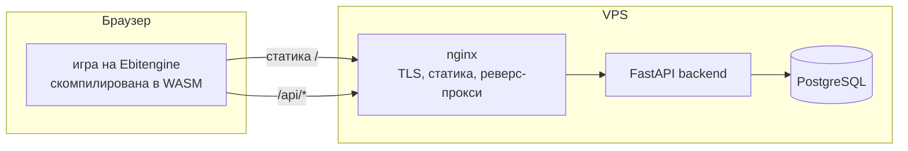

# YurneROGUE

Браузерный рогалик во вселенной Dota 2 — Go, скомпилированный в WebAssembly,
глобальный лидерборд и полный CI/CD-пайплайн с деплоем на VPS.

**Играть в браузере: https://yurnerogue.ru** — на десктопе и телефоне.

[English version](README.md)

| Десктоп | Мобильная версия |
|---------|------------------|
|  |  |

## О проекте

Тёмный Карнавал прошёл через джунгли и не ушёл целиком: его твари остались и
исказили лес. За Юрнеро-Джаггернаута ты прорубаешь поляны в чаще и спускаешься
на двадцать один круг вниз, к сердцу Карнавала. Каждый уровень генерируется
процедурно и сложнее предыдущего; каждый завершённый забег попадает в общий
для всех игроков лидерборд.

Это третья итерация проекта: он начинался как терминальный рогалик на Python
([rogue](https://github.com/stariydedd/rogue)), затем получил графический
интерфейс и DevOps-пайплайн, а в итоге был переписан на Go — почему, см.
[Зачем переписывали](#зачем-переписывали).

## Архитектура



Слои игры выстроены так, что зависимости смотрят внутрь:

- **`internal/domain/`** — правила и состояние: генерация уровней, бой,
  движение, туман войны. Не зависит ни от отрисовки, ни от ввода, ни от сети;
  единственный пакет с тестами.
- **`internal/render/`** — отрисовка на Ebitengine: спрайты, карта с камерой,
  HUD, меню и экранные тач-кнопки.
- **`internal/game/`** — конечный автомат, связывающий первые два, и ввод.
- **`internal/leaderboard/`** — HTTP-клиент, разделённый по платформам.
- **`backend/`** — сервис на FastAPI: `POST /api/runs`, `GET /api/leaderboard`,
  `GET /api/health`.
- **`infra/`** — Docker Compose и конфиг nginx (TLS, статика, прокси).

## Зачем переписывали

Python-версия уезжала в браузер через pygbag, а тот тянул с собой целый
интерпретатор CPython вместе с pygame — десятки мегабайт, которые надо было
не только скачать, но и скомпилировать на устройстве. На десктопе это
работало, а внутри webview Telegram не загружалось никогда.

Замеры на одном телефоне по LTE, с холодным кэшем:

| | Python (pygbag) | Go (Ebitengine) |
|---|---|---|
| Трафик | 15-25 МБ | **3.7 МБ** |
| Компиляция WASM на устройстве | десятки секунд | **0.05 с** |
| До первого кадра в Telegram | не загружалось | **3.1 с** |

Две находки из миграции стоит зафиксировать:

- **`net/http` стоит 1.65 МБ в gzip внутри WASM** — он тянет TLS и HTTP/2,
  которые браузерной сборке не нужны. Замена на родной `fetch` за тегом
  сборки ужала бандл с 5.4 МБ до 3.7 МБ.
- Рантайм Go нормально сеет генератор случайных чисел в WASM, поэтому костыль
  с пересеиванием по часам, нужный Python-сборке, больше не требуется.

## Технологии

| Категория | Инструменты |
|-----------|-------------|
| **Игра** | Go 1.26, Ebitengine, WebAssembly |
| **Бэкенд** | FastAPI, SQLAlchemy 2, PostgreSQL 16 |
| **Инфраструктура** | Docker Compose, nginx, Let's Encrypt |
| **CI/CD** | GitHub Actions, GitHub Container Registry |

## CI/CD

1. Push в `main` запускает GitHub Actions.
2. Параллельно проходят `lint` (gofmt, go vet) и тесты игры и бэкенда.
3. `build-web` компилирует игру в WASM и заранее сжимает бандл.
4. `build-backend-image` собирает Docker-образ и пушит его в GHCR.
5. `deploy` заливает статику по rsync, подтягивает новый образ бэкенда,
   перезапускает compose-стек, перечитывает конфиг nginx и завершается
   HTTPS-проверкой здоровья продакшена.

Линтер и vet работают под `GOOS=js GOARCH=wasm`: нативная сборка Ebitengine
на Linux потребовала бы заголовков X11 и OpenGL, которые браузерной цели
не нужны.

TLS-сертификаты выпускает Let's Encrypt, продлевает их `certbot.timer`;
хук продления перезагружает nginx в докере.

## Возможности

- 21 процедурно генерируемый уровень джунглей, туман войны, камера за игроком.
- 5 узнаваемых героев Доты в роли врагов, у каждого своё поведение и
  преследование игрока поиском в ширину.
- Предметы и баффы, классический бег (`F` + направление) — следует поворотам
  коридора и останавливается в дверных проёмах.
- Глобальный лидерборд, общий для всех игроков.
- Мобильная версия: портретная раскладка в стиле ретро-консоли — крестовина
  с кнопкой бега в центре, ромб кнопок предметов, контекстные SELECT/MENU.
- Вся графика — пиксель-арт, зашитый в бинарник, без отдельных запросов.

## Управление

| Клавиша | Действие |
|---------|----------|
| `W A S D` / стрелки | Движение |
| `F` + направление | Бег до препятствия |
| `H` | Оружие |
| `J` | Еда |
| `K` | Эликсир |
| `E` | Свиток |
| `F1` | Справка |
| `Q` | Возврат в меню |

В меню предметов выбор — цифрами или стрелками + `Enter`.

На тач-устройствах включается портретная консольная раскладка: крестовина —
движение, в её центре бег; ромб из четырёх кнопок — предметы; `SELECT` —
подтверждение (в игре `HELP`, в списке предметов `USE`), `MENU` — отмена или
выход. Добавленный к адресу `?touch=1` форсит эту раскладку в браузере
на десктопе.

## Противники

| Враг | Поведение |
|------|-----------|
| **Pudge** | Медлительный и живучий. Ходит случайно. |
| **Bloodseeker** | При ударе крадёт максимум здоровья. Первая атака игрока по нему отражается. Ходит по 8 направлениям. |
| **Riki** | Блинкует по комнате, невидим большую часть времени, пока не атакует. |
| **Axe** | Ходит на 2 клетки за ход. После атаки отдыхает, затем контратакует. От его удара нельзя увернуться. |
| **Skywrath Mage** | Ходит и бьёт по диагонали. Удар может усыпить. |

С каждым уровнем характеристики врагов растут, а полезных предметов меньше.

## Предметы

| Предмет | Эффект |
|---------|--------|
| Еда | Восстанавливает здоровье. |
| Эликсир | Временный бафф к силе, ловкости или максимуму HP на 20 ходов. |
| Свиток | Постоянный бафф к одной из характеристик. |
| Оружие | Экипируется через `H`; прежнее оружие падает рядом. |
| Сокровища | Начисляются за убитых врагов; определяют место в лидерборде. |

Выход — светящийся портал: спуск после 21-го уровня означает победу,
результат отправляется в глобальный лидерборд.

## Локальная разработка

```
go run ./cmd/game                                  # нативное окно
go test ./internal/domain/...                      # правила игры

GOOS=js GOARCH=wasm go build -o build/web/main.wasm ./cmd/game
cp "$(go env GOROOT)/lib/wasm/wasm_exec.js" build/web/
cp web/index.html web/favicon.png build/web/       # дальше раздать build/web

docker compose -f infra/docker-compose.yml up      # бэкенд + PostgreSQL на :8000
cd backend && python -m pytest tests               # тесты бэкенда
```

## Структура проекта

```
yurnerogue/
├── cmd/game/              # точка входа; раскладка выбирается по платформе
├── internal/
│   ├── domain/            # правила и состояние (без зависимостей от UI)
│   ├── render/            # отрисовка на Ebitengine, HUD, тач-кнопки
│   ├── game/              # конечный автомат и ввод
│   ├── leaderboard/       # HTTP-клиент (fetch в WASM, net/http нативно)
│   └── assets/            # пиксель-арт и шрифт, зашитые в бинарник
├── backend/               # FastAPI-сервис лидерборда + его тесты
├── infra/                 # docker-compose, nginx (TLS)
├── web/                   # HTML-обёртка и favicon
└── .github/workflows/     # CI/CD-пайплайн
```

## Ассеты

Спрайты героев и иконки предметов — фанатский пиксель-арт (Dota 2 © Valve,
некоммерческий фан-контент); сторонние шрифты и тайлы перечислены в
[internal/assets/LICENSE.txt](internal/assets/LICENSE.txt).
