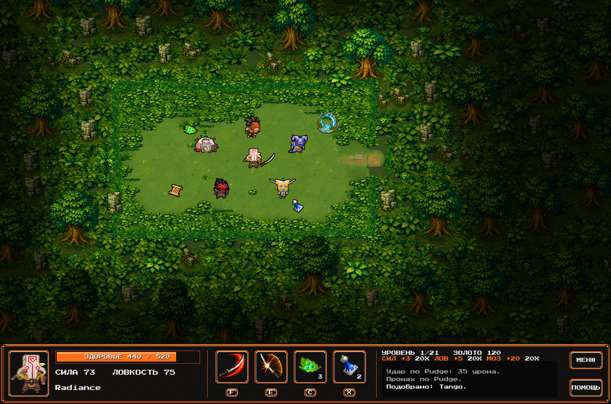
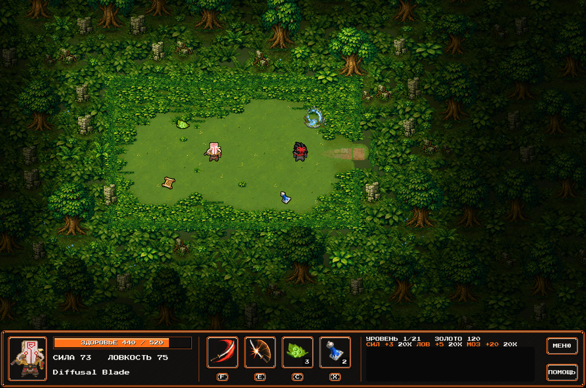
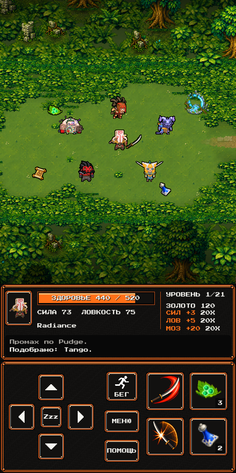
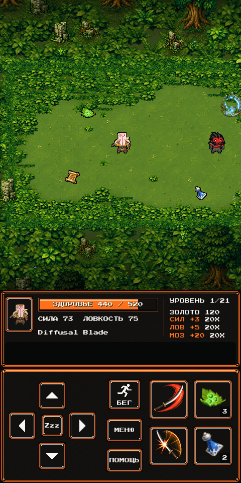
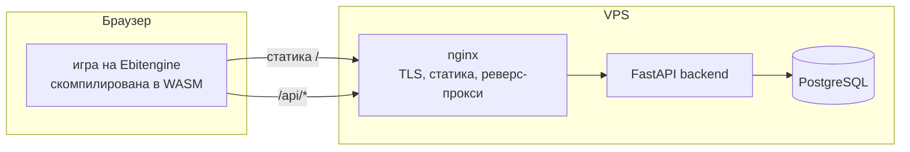

# YurneROGUE

Браузерный рогалик во вселенной Dota 2 — Go, скомпилированный в WebAssembly,
глобальный лидерборд и полный CI/CD-пайплайн с деплоем на VPS.

**Играть в браузере: https://yurnerogue.ru** — на десктопе и телефоне.

[English version](README.md)

### Десктоп

[](docs/screenshots/gameplay-ru.png)

[](docs/screenshots/fight-ru.gif)

### Мобильная версия

<p align="center">
  <a href="docs/screenshots/mobile-ru.png"></a>
  <a href="docs/screenshots/fight-mobile-ru.gif"></a>
</p>

Кадры текущей локальной сборки: демонстрационная сцена, снятая рендерером игры.

## О проекте

Играй за Джаггернаута и проходи 21 процедурно генерируемый лесной уровень.
Сражайся с пятью типами врагов, собирай предметы и улучшай характеристики
по мере роста сложности. Завершай рейтинговые забеги и соревнуйся
за место в глобальном лидерборде.

Это третья итерация проекта: он начинался как терминальный рогалик на Python
([rogue](https://github.com/stariydedd/rogue)), затем получил графический
интерфейс и DevOps-пайплайн, а в итоге был переписан на Go — почему, см.
[Зачем переписывали](#зачем-переписывали).

## Архитектура



Слои игры выстроены так, что зависимости смотрят внутрь:

- **`internal/domain/`** — правила и состояние: генерация уровней, бой,
  движение, туман войны. Не зависит ни от отрисовки, ни от ввода, ни от сети.
- **`internal/render/`** — отрисовка на Ebitengine: спрайты, карта с камерой,
  HUD, меню и экранные тач-кнопки.
- **`internal/game/`** — конечный автомат, связывающий первые два, и ввод.
- **`internal/leaderboard/`** — HTTP-клиент, разделённый по платформам.
- **`backend/`** — сервис на FastAPI: `POST /api/runs`, `GET /api/leaderboard`,
  `GET /api/health`.
- **`infra/`** — Docker Compose и конфиг nginx (TLS, статика, прокси).

## Зачем переписывали

Python-версия уезжала в браузер через pygbag, а тот тянул с собой целый
интерпретатор CPython вместе с pygame — десятки мегабайт, которые надо было
не только скачать, но и скомпилировать на устройстве. На десктопе это
работало, а внутри webview Telegram не загружалось никогда.

Исторические замеры первой Go-версии на одном телефоне по LTE, с холодным
кэшем — до визуального обновления, не показатели текущей сборки:

| | Python (pygbag) | Go (Ebitengine) |
|---|---|---|
| Трафик | 15-25 МБ | **3.7 МБ** |
| Компиляция WASM на устройстве | десятки секунд | **0.05 с** |
| До первого кадра в Telegram | не загружалось | **3.1 с** |

Две находки из миграции стоит зафиксировать:

- **`net/http` стоит 1.65 МБ в gzip внутри WASM** — он тянет TLS и HTTP/2,
  которые браузерной сборке не нужны. Замена на родной `fetch` за тегом
  сборки ужала бандл с 5.4 МБ до 3.7 МБ.
- Рантайм Go нормально сеет генератор случайных чисел в WASM, поэтому костыль
  с пересеиванием по часам, нужный Python-сборке, больше не требуется.

## Технологии

| Категория | Инструменты |
|-----------|-------------|
| **Игра** | Go 1.26, Ebitengine, WebAssembly |
| **Бэкенд** | FastAPI, SQLAlchemy 2, PostgreSQL 16 |
| **Инфраструктура** | Docker Compose, nginx, Let's Encrypt |
| **CI/CD** | GitHub Actions, GitHub Container Registry |

## CI/CD

1. Push в `main` запускает GitHub Actions.
2. Параллельно проходят `lint` (gofmt, go vet) и тесты игры и бэкенда.
3. `build-web` компилирует игру в WASM и заранее сжимает бандл.
4. `build-backend-image` собирает Docker-образ и пушит его в GHCR.
5. `deploy` заливает статику по rsync, подтягивает новый образ бэкенда,
   перезапускает compose-стек, перечитывает конфиг nginx и завершается
   HTTPS-проверкой здоровья продакшена.

Линтер и vet работают под `GOOS=js GOARCH=wasm`: нативная сборка Ebitengine
на Linux потребовала бы заголовков X11 и OpenGL, которые браузерной цели
не нужны.

TLS-сертификаты выпускает Let's Encrypt, продлевает их `certbot.timer`;
хук продления перезагружает nginx в докере.

## Возможности

- 21 процедурно генерируемый уровень джунглей, туман войны, камера за игроком.
- Густой лес в стиле Radiant: мох, корни, руины и естественные края полян;
  цельное травяное покрытие комнат и тропы коридоров.
- Новые спрайты Tango, Clarity, свитка и клинка; замшелый портал с ярким
  голубым свечением. Гейт локально становится прозрачнее за предметами и героями.
- Тёмная обводка помогает различать героев и лут. Кто ниже на экране, тот
  рисуется впереди. Статичное окружение кэшируется.
- 5 узнаваемых героев Доты в роли врагов, у каждого своё поведение и
  преследование игрока поиском в ширину.
- Предметы и баффы, классический бег (`R` + направление): следует поворотам
  коридора и останавливается в дверных проёмах.
- Две способности: критический удар с уроном x1,5 и парирование, которое
  на один ход блокирует удары врагов и бьёт атакующих в ответ.
- Глобальный лидерборд, общий для всех игроков.
- Чёрно-оранжево-белый HUD на десктопе и телефоне: анимированный портрет,
  слоты способностей и предметов с перезарядкой и счётчиками, здоровье
  (краснеет ниже 25%), таймеры временных бонусов и журнал последних событий.
- Мобильное управление: крестовина, отдельная кнопка RUN, сетка 2×2
  со способностями и предметами и контекстные SELECT/MENU.
- Вся графика — пиксель-арт, зашитый в бинарник, без отдельных запросов.
- Собственная синтезированная фэнтези-музыка и эффекты боя, предметов и портала.
  Попадания мечом используют три добавленные записи Джагернаута из Dota 2:
  файлы встроены в игру и чередуются без одинаковых подряд.
  Промахи чередуют две добавленные записи взмаха клинка. Попадание критическим
  ударом звучит одной из записей удара с добавленной записью Blade Dance поверх,
  отпарированный удар звоном клинка,
  у заточки оружия свой синтезированный звук точильного камня.
  MUSIC и SFX в главном меню и в игровом MENU меняют громкость с шагом 25%, включая выключение
  (на десктопе также M и V). Настройки сохраняются локально; в браузере звук
  запускается после взаимодействия со страницей.
  Для травы и троп — по четыре перемешиваемых варианта шагов без одинаковых
  подряд. Шаги тише боя, их громкость регулируется общей настройкой SFX.

## Управление

| Клавиша | Действие |
|---------|----------|
| `W A S D` / стрелки | Движение |
| `R` + направление | Бег до препятствия |
| `Z` | Пропустить ход (пусть враги подойдут сами) |
| `F` + направление | Критический удар |
| `E` | Парирование |
| `C` | Еда |
| `X` | Эликсир |
| `F1` | Справка |
| `Q` | Игровое меню: продолжение, громкость, выход |

На десктопе слоты HUD, меню и справка также доступны мышью.
Справка состоит из двух страниц: «Управление» (клавиши или экранные кнопки
и способности) и «Глоссарий» (враги и предметы); переключение: ←/→ или кнопка рядом с «Назад».
В меню предметов выбор — цифрами или стрелками + `Enter`.
Десктопная сборка открывается в окне 1280×720 с изменяемым размером; `F11`
переключает полноэкранный режим (в браузере через полноэкранный режим самого браузера).

На тач-устройствах включается портретная консольная раскладка: крестовина —
движение, в её центре кнопка ожидания (Zzz); отдельная кнопка `RUN`, затем направление: бег;
сетка 2×2: критический удар, еда, парирование и эликсир; `SELECT`:
подтверждение (в игре `HELP`, в списке предметов `USE`), `MENU` — игровое меню
или отмена диалога. Добавленный к адресу `?touch=1` форсит эту раскладку в браузере
на десктопе.

Меню десктопа и телефона используют единый стиль и кнопки PLAY, LEADERBOARD и HELP.
На десктопе доступны мышь и выбор с клавиатуры, на телефоне — прямые нажатия.
Имя на телефоне вводится через настоящее текстовое поле с экранной клавиатурой.
Если сервер не подтвердил старт, экран имени показывает ошибку; PLAY повторяет запрос.
На экранах меню есть отдельная кнопка BACK; мобильная крестовина и панель предметов появляются во время игры.

## Противники

| Враг | Поведение |
|------|-----------|
| **Pudge** | Медлительный и живучий. Ходит случайно. |
| **Bloodseeker** | При ударе крадёт максимум здоровья. Первая атака игрока по нему отражается. Ходит по 8 направлениям. |
| **Riki** | Блинкует по комнате, невидим большую часть времени, пока не атакует. |
| **Axe** | Ходит на 2 клетки за ход. После атаки отдыхает, затем контратакует. От его удара нельзя увернуться. |
| **Skywrath Mage** | Ходит и бьёт по диагонали. Удар может усыпить. |

Враги растут с каждым уровнем после первого: здоровье +8%, сила +4%, ловкость +1,5%
за уровень. Bloodseeker крадёт 10 + 2 × уровень максимума здоровья за удар.
Глубже в комнатах больше врагов и меньше предметов.

## Предметы

| Предмет | Эффект |
|---------|--------|
| Еда (Tango) | Лечит в зависимости от глубины, а не от максимума здоровья: 25-50 на 1-м уровне, до 75-150 на 21-м, но не выше максимума. |
| Эликсир (Clarity) | Временный бафф к силе, ловкости или максимуму HP на 20 ходов, вдвое сильнее свитка той же глубины. |
| Свиток (вид TP Scroll) | Применяется при подборе: постоянный бафф к одной из характеристик, растёт с глубиной (сила или ловкость +2…+3 на 1-м уровне и +6…+9 на 21-м; максимум здоровья +13…+25 и +63…+125, заодно лечит на столько же). Не занимает место в рюкзаке. |
| Оружие (клинок Juggernaut) | Бонус от +1 до +50 и растёт с глубиной: +1…+17 на 1-м уровне, +36…+50 на 21-м. Название показывает силу, по цене предметов в Dota 2, шагом в пять пунктов: Crystalys (+1…+5), Yasha, Diffusal Blade, Shadow Blade, Desolator, Battle Fury, Radiance, Butterfly, Silver Edge, Abyssal Blade (+46…+50). Бонус прибавляется к урону Quelling Blade и растёт с силой (при стартовой силе около +1,2 урона за пункт). Экипируется при подборе, если бьёт сильнее, поэтому любое оружие заменяет стартовое; иначе затачивает текущее оружие на +1, так что любое найденное оружие делает вас сильнее. Заточенное оружие получает название по новому бонусу: например, Shadow Blade +20 становится Desolator +21. |
| Сокровища | Начисляются за убитых врагов; определяют место в лидерборде. |

Quelling Blade — постоянное стартовое оружие без бонуса к характеристикам,
с прежним базовым уроном. Любое более сильное оружие заменяет его.

## Способности

| Способность | Эффект |
|-------------|--------|
| Критический удар (`F`, затем направление) | Бьёт соседнего врага в выбранном направлении с уроном x1,5. Заряжается за 3 обычные атаки (промахи тоже считаются), а не за ходы, поэтому ходьба между боями его не заряжает. Выбор направления бесплатен; `F` или `Esc` отменяют его, а направление без врага не тратит ход. |
| Парирование (`E`) | Работает только рядом с врагом, который может ударить (Skywrath и по диагонали); иначе ход не тратится. Каждый удар врага в этот ход блокируется полностью (без урона, без кражи максимума здоровья у Bloodseeker и без сна от Skywrath), а атакующий получает ответный удар в половину вашего обычного урона. Промах и отдыхающий Axe ответа не получают. Заряжается за 3 полученных удара, как критический удар за 3 атаки; отпарированные удары и ходьба не считаются. |

На кнопках способностей видно, сколько атак осталось до заряда удара и сколько полученных ударов до парирования. Во сне способности не
срабатывают: ход пропускается как обычно.

Предметы получили короткие названия в духе Доты: Phantom Clarity,
Aghanim's Scroll, Yasha и другие. Название не меняет эффект категории.
HUD показывает временные бонусы STR, AGI и MAX HP (MHP на телефоне).
Бонусы одной характеристики складываются; таймер отсчитывает ходы
до ближайшего уменьшения этой суммы.

Образы из Доты не меняют эффекты: Clarity даёт бафф характеристик, а свиток
не телепортирует. Выход — портал с голубым свечением: спуск после 21-го уровня означает победу,
результат отправляется в глобальный лидерборд.

## Локальная разработка

```
go run ./cmd/game                                  # нативное окно
go test ./...                                      # все Go-тесты

GOOS=js GOARCH=wasm go build -o build/web/main.wasm ./cmd/game
cp "$(go env GOROOT)/lib/wasm/wasm_exec.js" build/web/
cp web/index.html web/favicon.png build/web/       # дальше раздать build/web

docker compose -f infra/docker-compose.yml up      # бэкенд + PostgreSQL на :8000
cd backend && python -m pytest tests               # тесты бэкенда
```

Нативная сборка ходит в продакшен (`https://yurnerogue.ru`), если не задан
`ROGUE_API`. Когда локальные правила отличаются от продакшена (новый
`domain.RulesVersion`), прод отклоняет старт рейтингового забега с ошибкой
«Game rules changed». В этом случае поднимите локальный бэкенд и направьте игру
на него: `ROGUE_API=http://localhost:8000 go run ./cmd/game`
(PowerShell: `$env:ROGUE_API="http://localhost:8000"; go run ./cmd/game`).
После изменения правил пересоберите образ бэкенда:
`docker compose -f infra/docker-compose.yml up --build`.

## Структура проекта

```
yurnerogue/
├── cmd/game/              # точка входа; раскладка выбирается по платформе
├── internal/
│   ├── domain/            # правила и состояние (без зависимостей от UI)
│   ├── render/            # отрисовка на Ebitengine, HUD, тач-кнопки
│   ├── game/              # конечный автомат и ввод
│   ├── leaderboard/       # HTTP-клиент (fetch в WASM, net/http нативно)
│   └── assets/            # пиксель-арт и шрифт, зашитые в бинарник
├── backend/               # FastAPI-сервис лидерборда + его тесты
├── infra/                 # docker-compose, nginx (TLS)
├── web/                   # HTML-обёртка и favicon
├── tools/                 # упаковка спрайтов и снимки локального рендерера
├── docs/art/              # финальные исходники для упаковки спрайтов
└── .github/workflows/     # CI/CD-пайплайн
```

## Ассеты

Окружение использует набор Radiant из `internal/assets/custom/radiant/`.
Предметы и портал — фанатские интерпретации дизайнов Dota 2. Спрайты героев
и favicon взяты из Dota 2 (© Valve), шрифт — Press Start 2P.
Источники и лицензионные сведения перечислены в
[internal/assets/LICENSE.txt](internal/assets/LICENSE.txt).

## Лицензия

Собственный код проекта, документация, процедурно сгенерированные музыка и
звуковые эффекты доступны по [лицензии MIT](LICENSE).
Графика, шрифты, записи из Dota 2 и другие сторонние материалы не входят в это
разрешение MIT: права на них и применимые условия остаются отдельными.
Область действия лицензии описана в [NOTICE.txt](NOTICE.txt), источники и
атрибуция — в [уведомлениях об ассетах](internal/assets/LICENSE.txt).
Указание авторства само по себе не даёт разрешения распространять материалы Valve.
